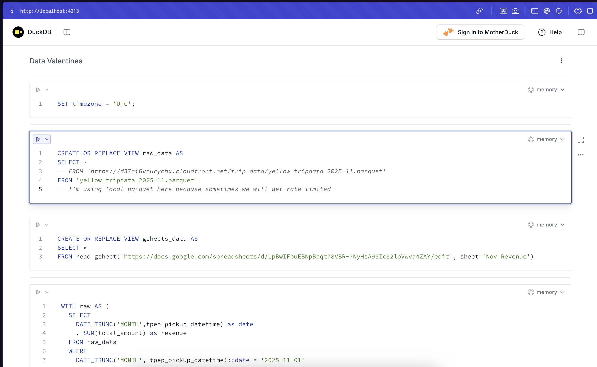
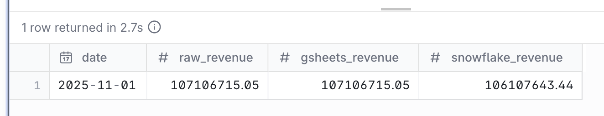
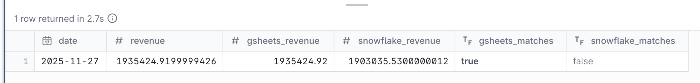
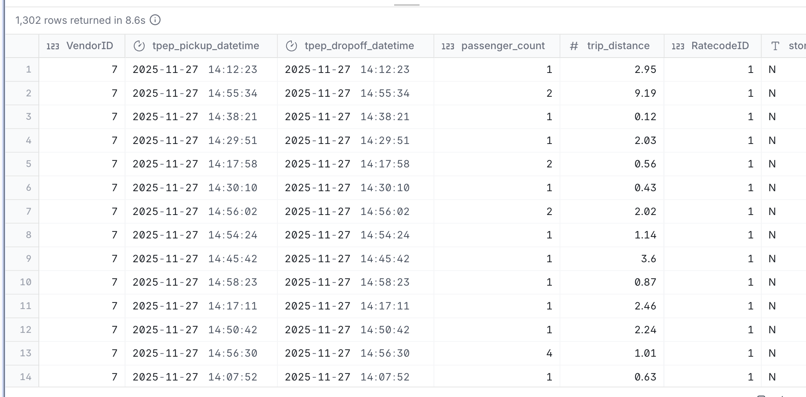

# Dear Snowflake, I Want an Open Relationship

**Data Valentine Challenge 2026** | Hosted by [Greybeam](https://www.greybeam.ai)

Greybeam deploys multi-engine query infrastructure. We provide a single endpoint that translates and routes queries to the most optimal query engine.

---

## The Scenario

It's the end of November 2025. Your CFO pulls together revenue data for the month in Google Sheets and asks:

> "Why don't these numbers match what's in Snowflake?"

You check Snowflake. You check Google Sheets. The numbers are actually different. How do we check the raw feed?

**Your mission:** Your data lives in three places. Snowflake can't query the others. How do you join across systems without building a pipeline?

---

## Prerequisites

- [DuckDB CLI](https://duckdb.org/docs/installation/) installed (v1.4.0+)
- ADBC driver in the DuckDB extensions directory (see below)
- Save the `valentines_key.p8` to your local drive
- Ability to access this [Google Sheet](https://docs.google.com/spreadsheets/d/1pBwIFpuEBNpBpqt78VBR-7NyHsA95Ic52lpVwva4ZAY/edit)

## Installing the ADBC driver
To connect to Snowflake, we'll be using the Snowflake community extension [here](https://github.com/iqea-ai/duckdb-snowflake).

Note that you should do this step **after** DuckDB has been installed.

This extension uses ADBC to connect to Snowflake and will only work if it's installed in your extension directory. The folks behind this extension have made that easy. Install by executing one of the following below in your terminal.

Linux / macOS / WSL:
```
# Using curl
curl -sSL https://raw.githubusercontent.com/iqea-ai/duckdb-snowflake/main/scripts/install-adbc-driver.sh | sh

# Or using wget
wget -qO- https://raw.githubusercontent.com/iqea-ai/duckdb-snowflake/main/scripts/install-adbc-driver.sh | sh
```

Windows (PowerShell):
```
# Download and run the installer
iwr -useb https://raw.githubusercontent.com/iqea-ai/duckdb-snowflake/main/scripts/install-adbc-driver.bat -OutFile install-adbc-driver.bat
.\install-adbc-driver.bat
```

Other setup options can be found [here](https://github.com/iqea-ai/duckdb-snowflake?tab=readme-ov-file#adbc-driver-setup).

---

## Let's Investigate!

### Step 1: Set Up DuckDB with Extensions

Open up your terminal and enter the DuckDB CLI by typing `duckdb` and hit enter.

It should look something like this after:
```
DuckDB v1.4.3 (Andium) d1dc88f950
Enter ".help" for usage hints.
Connected to a transient in-memory database.
Use ".open FILENAME" to reopen on a persistent database.
D 
```

We're now in the DuckDB CLI! Let's install the extensions.

```sql
-- Install and load extensions
INSTALL snowflake FROM community;
LOAD snowflake;

INSTALL httpfs;
LOAD httpfs;

INSTALL gsheets FROM community;
LOAD gsheets;
```

---

### Step 2: Authenticate Google Sheets
```sql
-- This will open a browser and prompt you to login to Google
CREATE SECRET (TYPE gsheet);
```

After you login, Google will output a token for you to enter back into your terminal as per below:
```sql
CREATE SECRET (TYPE gsheet);
Visit the below URL to authorize DuckDB GSheets
https://accounts.google.com/o/oauth2/v2/auth?client_id=<bunch of mumbo jumbo here>
After granting permission, enter the token: <the token you copied from Google>
```
Note that this key expires and if you suddenly aren't able to query the sheet anymore, you may need to refresh the key. More info [here](https://github.com/evidence-dev/duckdb_gsheets?tab=readme-ov-file#authenticate).

Now let's try querying our Google sheet!
```sql
SELECT *
FROM read_gsheet('https://docs.google.com/spreadsheets/d/1pBwIFpuEBNpBpqt78VBR-7NyHsA95Ic52lpVwva4ZAY/edit', sheet='Nov Revenue');
```
```
┌────────────┬────────────┐
│    date    │  revenue   │
│  varchar   │   double   │
├────────────┼────────────┤
│ 2025-11-01 │ 3920642.34 │
│ 2025-11-02 │ 4038046.73 │
│ 2025-11-03 │ 3440996.73 │
│ 2025-11-04 │ 3309074.19 │
│ 2025-11-05 │ 3782371.66 │
│ 2025-11-06 │ 4170177.29 │
│ 2025-11-07 │ 3837127.41 │
│ 2025-11-08 │ 3512572.33 │
│ 2025-11-09 │ 3482795.85 │
│ 2025-11-10 │ 3453564.96 │
│ 2025-11-11 │ 3346731.31 │
│ 2025-11-12 │ 3770068.66 │
│ 2025-11-13 │ 4004721.93 │
│ 2025-11-14 │ 3820316.72 │
│ 2025-11-15 │ 3509505.64 │
│ 2025-11-16 │ 3658041.52 │
│ 2025-11-17 │ 3689408.27 │
│ 2025-11-18 │ 4021558.48 │
│ 2025-11-19 │ 4371903.76 │
│ 2025-11-20 │ 4560643.07 │
│ 2025-11-21 │ 4292848.69 │
│ 2025-11-22 │ 3949250.15 │
│ 2025-11-23 │ 3331567.66 │
│ 2025-11-24 │ 2990919.34 │
│ 2025-11-25 │ 3583922.01 │
│ 2025-11-26 │ 3002204.15 │
│ 2025-11-27 │ 1935424.92 │
│ 2025-11-28 │ 2351068.61 │
│ 2025-11-29 │ 2823233.98 │
│ 2025-11-30 │ 3146006.69 │
├────────────┴────────────┤
│ 30 rows       2 columns │
└─────────────────────────┘
```

Awesome! We can query our Google Sheets.

### Step 3: Connect to Snowflake

Update the `PRIVATE_KEY` path to where you saved your `valentines_key.p8`.
```sql
-- Attach Snowflake using key-pair authentication
CREATE SECRET snowflake_keypair (
    TYPE snowflake,
    ACCOUNT 'TZB07477',
    USER 'VALENTINES_USER',
    AUTH_TYPE 'key_pair',
    PRIVATE_KEY '/path/to/valentines_key.p8',
    DATABASE 'GREYBEAM',
    WAREHOUSE 'VALENTINES_WH'
);
```
```
┌─────────┐
│ Success │
│ boolean │
├─────────┤
│ true    │
└─────────┘
```
Note that what you input into the `DATABASE` parameter sets your default database.

Now, let's connect to Snowflake by attaching it as a database!
```sql
ATTACH '' AS snowflake_db (
      TYPE snowflake, 
      SECRET snowflake_keypair, 
      READ_ONLY,
      enable_pushdown true);
```
```
[Snowflake Ext INFO] GetCredentials: auth_type_str = 'key_pair'
[Snowflake Ext INFO] Set auth_type to KEY_PAIR
[Snowflake Ext INFO] Extension directory: /Users/kylecheung/.duckdb/extensions/v1.4.3/osx_arm64
[Snowflake Ext INFO] Final adbc driver path: /Users/kylecheung/.duckdb/extensions/v1.4.3/osx_arm64/libadbc_driver_snowflake.so
```

Try running a query:
```sql
SELECT
    *
FROM snowflake_db.valentines.revenue_raw_2025_11
LIMIT 10;
```
Just like that, we're able to query from both Google and Snowflake.

### Step 4: Querying the Raw Data
Finally, let's make sure we can query the raw data:
```sql
SELECT *
FROM 'https://d37ci6vzurychx.cloudfront.net/trip-data/yellow_tripdata_2025-11.parquet' 
LIMIT 10;
```
Amazing, we're now able to query three different sources all in the same environment. DuckDB is awesome!

---

### Step 4: Dig In!

Now that we're all setup, let's use the nifty DuckDB UI by calling the function below.
```sql
call start_ui();
```

You'll see a familiar notebook interface. If you've used Jupyter or Hex, you'll feel right at home. Each cell is an executable chunk. You write SQL, hit run, and results appear right below. You can iterate cell by cell without re-running everything.


**Setup Views/Tables and Set Time Zone**

Let's create views on each of our data sources so they're easier to reference.
```sql
SET timezone = 'UTC';
-- Gotta love time zones!

CREATE OR REPLACE VIEW raw_data AS
SELECT *
FROM 'https://d37ci6vzurychx.cloudfront.net/trip-data/yellow_tripdata_2025-11.parquet';
-- Note that you may hit a GET error due to rate limits

CREATE OR REPLACE VIEW gsheets_data AS 
SELECT *
FROM read_gsheet('https://docs.google.com/spreadsheets/d/1pBwIFpuEBNpBpqt78VBR-7NyHsA95Ic52lpVwva4ZAY/edit', sheet='Nov Revenue');

CREATE OR REPLACE VIEW snowflake_data AS
SELECT * 
FROM snowflake_db.VALENTINES.REVENUE_RAW_2025_11;
```

**Is Our Data Actually Wrong?**

Let's take a look at the monthly aggregates and see whether Snowflake is actually wrong.
```sql
WITH raw AS (
  SELECT
    DATE_TRUNC('MONTH',tpep_pickup_datetime) as date
    , SUM(total_amount) as revenue
  FROM raw_data
  WHERE
    DATE_TRUNC('MONTH', tpep_pickup_datetime)::date = '2025-11-01'
  GROUP BY 1
),

gsheets AS (
  SELECT
    DATE_TRUNC('MONTH', date::date) as date
    , SUM(revenue) as revenue
  FROM gsheets_data
  GROUP BY 1
),

snowflake AS (
  SELECT
    DATE_TRUNC('MONTH', pickup_at) as date
    , SUM(total_amount) as revenue
  FROM snowflake_data
  GROUP BY 1
)

SELECT
  r.date
  , ROUND(r.revenue, 2) as raw_revenue
  , ROUND(g.revenue, 2) as gsheets_revenue
  , ROUND(s.revenue, 2) AS snowflake_revenue
FROM raw AS r
LEFT JOIN gsheets AS g
  ON r.date = g.date
LEFT JOIN snowflake AS s
  ON r.date = s.date
```

Looks like our Snowflake data IS indeed off.


**Is Everyday Off?**

Let's take a look at the daily grain and see whether data is consistently wrong.
```sql
WITH raw AS (
  SELECT
    tpep_pickup_datetime::date as date
    , SUM(total_amount) as revenue
  FROM raw_data
  WHERE
    DATE_TRUNC('MONTH', tpep_pickup_datetime)::date = '2025-11-01'
  GROUP BY 1
),

snowflake AS (
  SELECT
    pickup_at::date as date
    , SUM(total_amount) as revenue
  FROM snowflake_data
  GROUP BY 1
)

SELECT
  r.*
  , g.revenue as gsheets_revenue
  , s.revenue AS snowflake_revenue
  , ABS(gsheets_revenue - r.revenue) < 1 as gsheets_matches
  , ABS(s.revenue - r.revenue) < 1 as snowflake_matches
FROM raw AS r
LEFT JOIN gsheets_data AS g
  ON r.date = g.date
LEFT JOIN snowflake AS s
  ON r.date = s.date
WHERE
  NOT gsheets_matches OR NOT snowflake_matches
```

Phew, only the 27th is wrong.


**Is Data Missing?**

Let's join our Snowflake data against the source of truth and see what might be missing.
```sql
SELECT
  t.*
FROM raw_data as t
LEFT JOIN snowflake_data AS s
  ON t.VENDORID = s.VENDORID
  AND t.tpep_pickup_datetime = s.PICKUP_AT
WHERE
  t.tpep_pickup_datetime::date = '2025-11-27'
  AND s.pickup_at IS NULL
```

**Vendor ID 7 is completely missing from Snowflake on 2025-11-27.**



The Google Sheets dashboard was built from the raw API feed — so it has the correct numbers. Snowflake somehow lost all of `VENDORID=7`'s data for that specific day.

Mystery solved. Time to file a ticket with the data engineering team.

---

## The Greybeam Way

What you just did works. But it required:

- Installing multiple DuckDB extensions
- Managing Snowflake credentials and key files
- Wrangling with finicky extensions

**With Greybeam**, you get a single interface to query across Snowflake, DuckDB, Google Sheets, APIs, etc. all in the BI tools you're already using.

Greybeam will automatically route and translate queries to the most optimal query engine.

Built with love by [Greybeam](https://www.greybeam.ai).
